> **Version**: 4.0 · **Last Updated**: 2026-03-01 · **Architecture**: High-Velocity Concurrent Architecture (Shared Locking + Multi-Key/Multi-Model LLM Rotation + Adaptive Learning)

## Table of Contents

1. [System Overview](#1-system-overview)
2. [Project File Map](#2-project-file-map)
3. [Leo.py — Step-by-Step Execution Flow](#3-leopy--step-by-step-execution-flow)
4. [Design & UI/UX](#4-design--uiux)
5. [Data Flow Diagram](#5-data-flow-diagram)

---

## 1. System Overview

LeoBook is a **fully autonomous sports prediction and betting system** comprised of two halves:

| Half | Technology | Purpose |
|------|-----------|---------||
| **Backend (Leo.py)** | Python 3.12 + Playwright | Autonomous data extraction, rule-based prediction, odds harvesting, bet placement, withdrawal management, and system health monitoring |
| **Frontend (leobookapp)** | Flutter/Dart (flutter_bloc/Cubit) | Dashboard with "Telegram-grade" density, liquid glass aesthetics, and proportional scaling |

**Leo.py** is a **pure orchestrator** — it contains zero business logic. All logic lives in the modules it imports. It runs in an infinite loop, executing a cycle every 6h. The engine uses **High-Velocity Concurrent Execution** via a per-match sequential pipeline, protected by a global `CSV_LOCK` for storage integrity. A **live score streamer** runs in its own isolated Playwright session in parallel.

---

## 2. Project File Map

### 2.1 Root Files

| File | Function | Called by Leo.py? |
|------|----------|:-:|
| `Leo.py` | Central orchestrator — runs the entire system in a loop | **Entrypoint** |
| `.env` | API keys (Gemini, Grok, Supabase, Football.com), config | ✅ via `dotenv` |
| `RULEBOOK.md` | Developer rules (MANDATORY reading) | — |
| `AIGO_Learning_Guide.md` | Documentation for the AIGO subsystem | — |
| `leobook_algorithm.md` | Algorithm whitepaper | — |
| `SUPABASE_SETUP.md` | Supabase setup instructions | — |

### 2.2 `Core/` — System Infrastructure

| Directory | Files | Purpose |
|-----------|-------|---------|
| `Core/Intelligence/` | `rule_engine.py`, `rule_config.py`, `goal_predictor.py`, `learning_engine.py`, `rule_engine_manager.py`, `aigo_engine.py`, `aigo_suite.py`, `interaction_engine.py`, `visual_analyzer.py`, `memory_manager.py`, `selector_db.py`, `selector_manager.py`, `unified_matcher.py`, `popup_handler.py`, `llm_health_manager.py`, `api_manager.py` | AI engine, AIGO self-healing, LLM health, selectors, adaptive learning |
| `Core/Browser/` | `page_analyzer.py`, `html_utils.py`, extractors | Playwright automation, DOM analysis, data extractors |
| `Core/System/` | `lifecycle.py`, `monitoring.py`, `withdrawal_checker.py` | CLI parsing, oversight, withdrawal logic |
| `Core/Utils/` | `constants.py`, utilities | Shared constants |

### 2.3 `Modules/` — Domain Logic

| File | Function |
|------|----------|
| `Modules/Flashscore/manager.py` | Match pipeline orchestration (concurrent workers), match sorting by `match_time` |
| `Modules/Flashscore/fs_schedule.py` | Schedule extraction with 2-tier header expansion |
| `Modules/Flashscore/fs_processor.py` | Per-match H2H + Standings + League Enrichment + Search Dict |
| `Modules/Flashscore/fs_extractor.py` | Core data extraction from match pages |
| `Modules/Flashscore/fs_live_streamer.py` | Isolated live score streaming with delta-only push, 2.5hr auto-finish rule |
| `Modules/Flashscore/fs_offline_reprediction.py` | Offline reprediction engine |
| `Modules/FootballCom/fb_manager.py` | Odds harvesting, automated booking |
| `Modules/FootballCom/navigator.py` | Football.com navigation, balance extraction |
| `Modules/FootballCom/booker/slip.py` | Bet slip interactions |
| `Modules/FootballCom/booker/placement.py` | Bet placement execution |

### 2.4 `Data/` — Persistence Layer

| File | Function |
|------|----------|
| `Data/Access/db_helpers.py` | CSV CRUD, `CSV_LOCK`, market evaluation, `init_csvs()` |
| `Data/Access/sync_manager.py` | `SyncManager` — bi-directional sync for 12 tables with pandas delta detection |
| `Data/Access/outcome_reviewer.py` | Outcome review (offline + browser fallback with 2h time pre-filter) |
| `Data/Access/prediction_accuracy.py` | Accuracy report generation |
| `Data/Access/supabase_client.py` | Supabase client singleton |
| `Data/Supabase/push_schema.py` | Auto-provisioning schema |

### 2.5 `Scripts/` — Pipeline Scripts

| File | Function |
|------|----------|
| `Scripts/build_search_dict.py` | Team/league LLM enrichment (ASCENDING model chain) |
| `Scripts/enrich_leagues.py` | League metadata extraction |
| `Scripts/enrich_all_schedules.py` | Deep schedule enrichment with standings |
| `Scripts/recommend_bets.py` | Recommendation engine |
| `Scripts/backtest_monitor.py` | Backtest trigger detection |

### 2.6 `leobookapp/` — Flutter App

| Directory | Feature | Purpose |
|-----------|---------|---------|
| `lib/core/constants/` | **`responsive_constants.dart`** | `Responsive.sp()` / `Responsive.dp()` for proportional scaling |
| `lib/logic/cubit/` | **State Management** | `HomeCubit`, `UserCubit`, `SearchCubit` (flutter_bloc) |
| `lib/data/models/` | **Data Models** | `MatchModel` (status display, accuracy evaluation), `UserModel` |
| `lib/presentation/widgets/desktop/` | **Desktop-Only** | `DesktopHomeContent`, `DesktopHeader`, `NavigationSidebar` |
| `lib/presentation/widgets/mobile/` | **Mobile-Only** | `MobileHomeContent` — full mobile home layout with tabs |
| `lib/presentation/widgets/shared/` | **Reusable** | `MatchCard`, `FeaturedCarousel`, `NewsFeed`, `AccuracyReportCard`, etc. |
| `lib/presentation/screens/` | **Dispatchers** | Pure viewport dispatchers — render desktop or mobile widget tree |

---

## 3. Leo.py — Step-by-Step Execution Flow

Leo.py orchestrates the cycle in sequential and concurrent phases:

### Startup Flow
1. **Singleton Check**: Ensure only one instance runs via `leo.lock`.
2. **Config Validation**: Verify required env vars (`GEMINI_API_KEY`, `GROK_API_KEY`, `FB_PHONE`, `FB_PASSWORD`).
3. **CSV Init**: Create local databases if missing.
4. **Browser Engine**: Launch Playwright context.
5. **Live Streamer**: Spawn isolated streamer task.

### Per-Cycle Logic (6h Cycle)

#### Prologue P1: Sequential Prerequisite
| # | Module Called | Action |
|---|-------------|--------|
| 1 | `SyncManager` | Bi-directional Supabase handshake with auto-provisioning |
| 2 | `outcome_reviewer` | Match outcome review (offline + browser fallback) |
| 3 | `prediction_accuracy` | Print accuracy report |

#### Concurrent Phase: Prologue P2 ‖ Chapter 1→2
| Stream | Module | Action |
|:---|:---|:---|
| Stream A | `run_prologue_p2()` | Accuracy generation + final sync |
| Stream B | `run_chapter_1_p1()` | Concurrent match pipeline (H2H → Standings → Enrichment → Search Dict → Predict) |
| Stream B | `run_chapter_1_p2()` | Odds harvesting (returns session health) |
| Stream B | `run_chapter_1_p3()` | Final sync + recommendations |
| Stream B | `run_chapter_2_p1()` | Automated booking (if session healthy) |
| Stream B | `run_chapter_2_p2()` | Funds balance + withdrawal check |

#### Chapter 3: Sequential Finality
| # | Module Called | Action |
|---|-------------|--------|
| 1 | `monitoring.py` | Health check, oversight reporting |
| 2 | `backtest_monitor.py` | Backtest trigger detection + execution |

---

## 4. Design & UI/UX

### 4.1 Proportional Scaling
Standardized on a **375dp reference** for mobile and **1440dp** for desktop.
- `Responsive.sp(context, 16)` returns proportional results based on `MediaQuery.sizeOf(context).width`.
- Prevents UI overflows across all tested devices and browsers.

### 4.2 Liquid Glass Aesthetic
- **Fill Opacity**: 60% translucency for depth.
- **Blur Radius**: 16 sigma BackdropFilter.
- **Micro-Radii**: 14dp border radius for a sharp, dense look.

### 4.3 Match Status & Accuracy
- **FT (Pen)**: Exact status matching (`s == 'penalties'` or `s.contains('after pen')`) — avoids false positives.
- **Double Chance**: Team-name OR patterns (e.g., "Arsenal or Liverpool") evaluated correctly.
- **Accuracy Reports**: Sorted by match count DESC → accuracy DESC.

---

## 5. Data Flow Diagram

```mermaid
flowchart LR
    subgraph SOURCES ["External Sources"]
        FS[("Flashscore.com<br/>Match Data")]
        FB[("Football.com<br/>Betting Platform")]
        LLM[("Gemini Multi-Key/Model Rotation<br/>25+ Keys · 5 Models · dual chains")]
    end

    subgraph LEO ["Leo.py Orchestrator"]
        direction TB
        EXTRACT["Extract<br/>(Flashscore)"]
        PREDICT["Predict<br/>(Rule Engine)"]
        HARVEST["Harvest Odds<br/>(Football.com)"]
        BOOK["Place Bets<br/>(Football.com)"]
        AIGO["🛡️ AIGO<br/>(Self-Healing)"]
        MONITOR["Monitor<br/>(Health Check)"]
        REVIEW["Review<br/>(Outcome)"]
    end

    subgraph DATA ["Data Layer"]
        CSV[("Local CSVs<br/>12 tables")]
        LOCK["🔒 CSV_LOCK<br/>(Shared Locking)"]
        LW[("learning_weights.json<br/>Adaptive Rule Weights")]
        KJ[("knowledge.json<br/>Selector Knowledge Base")]
        SB[("Supabase<br/>Cloud Database")]
    end

    subgraph APP ["Flutter App"]
        MOBILE["📱 LeoBook App<br/>(Liquid Glass)"]
    end

    FS --> EXTRACT --> CSV
    CSV <--> LOCK
    CSV --> PREDICT --> CSV
    CSV --> HARVEST
    FB --> HARVEST --> CSV
    CSV --> BOOK --> FB
    HARVEST -.->|"selector failure logs"| AIGO
    BOOK -.->|"UI failure logs"| AIGO
    AIGO --> LLM
    AIGO -->|"persist selector & log_selector_failure"| KJ
    CSV <--> SB
    LW <--> SB
    SB --> MOBILE
    MONITOR --> CSV
    REVIEW --> LW
    CSV -.->|"compute adaptive accuracy"| MOBILE
    CSV -.->|"analyze outcomes"| LW
```

---
*Last updated: March 1, 2026*
*LeoBook Engineering Team*
